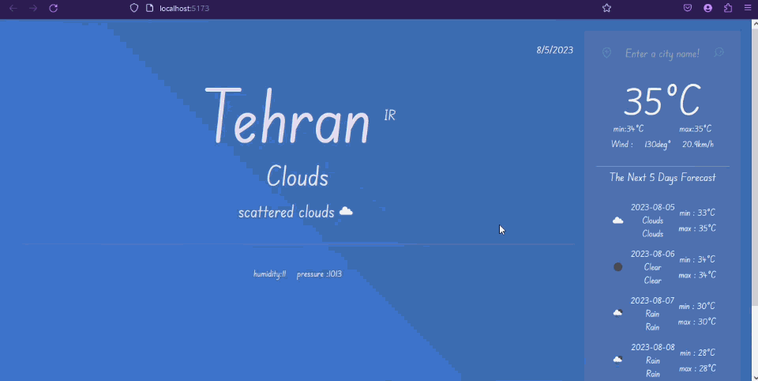

<a name="readme-top"></a>

<div align="center">
  <h1 align="center">Weather App</h1>
</div>
<br />
<!-- ABOUT THE PROJECT -->
<h2>This is a weather app demo</h2>

<br /><br />

<br /><br />
I coded this project with focusing on <strong><a href="https://react.dev">React.js</a></strong> library and css <strong><a href="https://tailwindcss.com/">tailwind</a></strong> framework.<br /><br />
I used open weather api for this project. <strong><a href="https://openweathermap.org/api">OpenWeather</a></strong><br />
<br/><br/>

### Built With

<br />
<br/>
<p align="left"> <a href="https://www.w3schools.com/css/" target="_blank" rel="noreferrer">  </a> <a href="https://www.w3.org/html/" target="_blank" rel="noreferrer">  </a> <a href="https://developer.mozilla.org/en-US/docs/Web/JavaScript" target="_blank" rel="noreferrer">  </a> <a href="https://reactjs.org/" target="_blank" rel="noreferrer">  </a> <a href="https://tailwindcss.com/" target="_blank" rel="noreferrer">  </a> </p>
<br/><br/>
<!-- GETTING STARTED -->
## Getting Started<br/>
This React project has built with [Vite](https://vitejs.dev/).<br/>
Vite is a local development server written by Evan You and used by default by Vue and for React project templates. It has support for TypeScript and JSX.
<br/><br/>
### Prerequisites<br/>
Note : Node.js must be installed on your system.<br/>
open your cmd and type:

```
npm install npm@latest -g
```

### Installation

1. Clone the repo

```
git clone https://github.com/20Amir01/weather-app.git
```

2.Open terminal in terminal directory for install NPM packages<br />

```
npm install
```

3. Type npm run dev to start project

```
npm run dev
```

<br /><br />

<!-- CONTRIBUTING -->

## Contributing<br />

Contributions are what make the open source community such an amazing place to learn, inspire, and create. Any <br />contributions you make are **greatly appreciated**.<br />

If you have a suggestion that would make this better, please fork the repo and create a pull request. You can also simply <br />open an issue with the tag "enhancement".<br />
Don't forget to give the project a star! Thanks again!<br />
<br />

1. Fork the Project<br />
2. Create your Feature Branch (`git checkout -b feature/AmazingFeature`)<br />
3. Commit your Changes (`git commit -m 'Add some AmazingFeature'`)<br />
4. Push to the Branch (`git push origin feature/AmazingFeature`)<br />
5. Open a Pull Request<br />

<br /><br />

<!-- LICENSE -->

## License

<br />
Distributed under the MIT License. See LICENSE.txt file for more information.

<br /><br />

<!-- CONTACT -->

## Contact

<br />
-my instagrame : <a href="https://instagram.com/20amirmohammad01" target="blank"></a> <br/>
-My Email Address : 20amhs00@gmail.com
<br />
